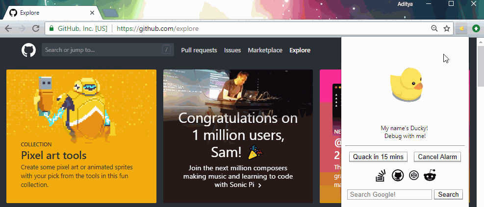

# Ducky

### Meet your online digital rubber duck for companionship & debugging -- Ducky! :baby_chick:

A chrome extension to overlay a tiny, adorable rubber duck, as a digital companion during rubber duck debugging and general development work. Why? 'cause who doesn't want a cute duck on their browser.



-----------------------
## Are you new to rubber duck debugging?


Meet **Ducky**, your adorable digital companion whom you can talk to, and rubber duck debug with. 

In addition to hanging around, Ducky is also responsible enough to set 15 minute alarms, should you want a short break soon, and not lose track of time.

Ducky is working on his memory and remembers the links to developer-friendly sites like StackOverflow, GitHub, Reddit and CodePen.

Ducky is also fairly shy, so don't try touching him with the mouse pointer or he may try dodging you. :wink:

## Set-Up Instructions

So you too want a Ducky of your own, eh?

It's easy! 
* Download the contents of this repository, and then go to ```chrome://extensions```
* Enable Developer Mode, if you haven't.
* Select ```Load Unpacked```
* Find the folder that contains all the files in this repository and select it.
* Ta-da! Ducky has arrived!

### Future Plans
* Add interactivity and emoji support :slightly_smiling_face:

~-  `Change Ducky's color`~ Done!
* ~Add alarm (quack?) support as break reminders~ Done! :alarm_clock:
* ~Add quick links to frequent websites~ Done! 
* Allow users to add their own websites as quicklinks
* Retrieve Google Search results within extension window for convenience and speed
* Add Google Keep and Evernote support for quick note-taking.
